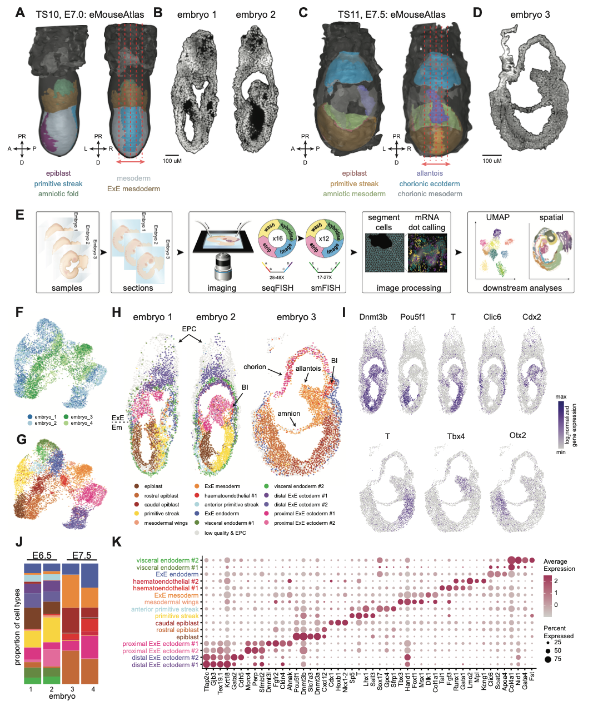

 

#### The Spatiotemporal Mouse Atlas is a shiny web app-based resource that can be used to interactively browse and download the data from: 

<a href="TBA" target="_blank"> TBA <i>bioRxiv</i> (2024)</a> 

 

 

#### Abstract
Here we provide a single-cell and spatial resolved high-throughput molecular map of timecourse of mouse embryos spanning gastrulation
and early organogenesis. We have integrated this data with the recently published Extended Mouse Atlas, and provide expertly curated
cell types for these samples, as well as full-transcriptome imputed gene expression. This online resource enables the research 
community to examine, at single cell level, the patterns of gene expression and emerging cell types at remarkably early developmental
stages. Further interactive element includes the ability to perform virtual dissection and DE analysis on-the-fly.

 

#### Experimental Design
Using the <a href="https://dx.doi.org/10.1038%2Fnmeth.2892" target="_blank">seqFISH platform</a> along with a novel approach for 
retaining cell membrane segmentation, we detected individual mRNA molecules for 351 genes in sagittal sections of n = 7 embryos (Embryonic days (E)6.5-E8.75).

  
 

 

#### Links
- The data is available to download **<a href="TBA" target="_blank">here</a>**.

 

#### Contact
Please contact Shila Ghazanfar (shila.ghazanfar-at-sydney.edu.au) or with any web app-related queries or suggestions.
